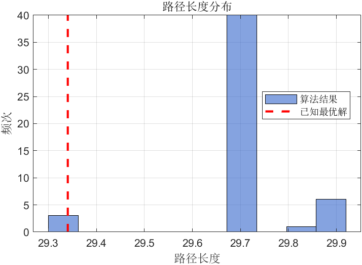
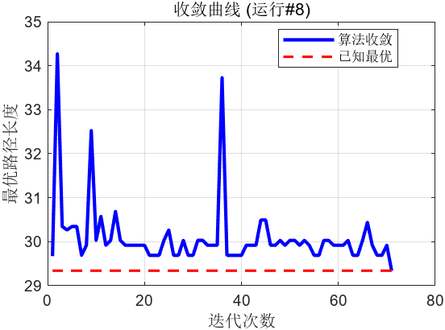
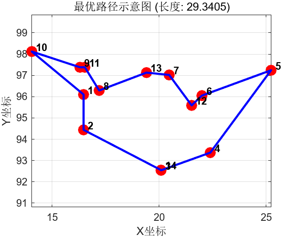

## I 问题描述

旅行商问题是组合优化领域中经典的 NP-hard 优化问题，简述如下：给定n个城市及其相互之间的距离，旅行商需要访问每个城市恰好一次，最后返回起点城市，目标是找到总距离最短的访问路径。其挑战主要源于其组合爆炸特性，可能的路径数量城市数量增加呈阶乘级增长，无法在合理时间内通过穷举法求解。

## II 源代码

```matlab
% 蚁群算法求解TSP问题
clear; clc; close all;  % 清除变量、命令窗口和图形窗口

% ==================== 参数设置 ====================
m = 10;        % 蚂蚁数量
itermax = 100; % 最大迭代次数
a = 1;         % 信息素重要程度因子
b = 5;         % 启发函数重要程度因子
r = 0.5;       % 信息素挥发系数
Q = 100;       % 信息素强度常数
t0 = 2;        % 初始信息素水平
runs = 50;     % 独立运行次数

% ==================== 城市坐标数据 ====================
% 14个城市的坐标 (TSP标准测试问题)
city = [
    16.47, 96.10;   % 1
    16.47, 94.44;   % 2
    20.09, 92.54;   % 3
    22.39, 93.37;   % 4
    25.23, 97.24;   % 5
    22.00, 96.05;   % 6
    20.47, 97.02;   % 7
    17.20, 96.29;   % 8
    16.30, 97.38;   % 9
    14.05, 98.12;   % 10
    16.53, 97.38;   % 11
    21.52, 95.59;   % 12
    19.41, 97.13;   % 13
    20.09, 92.55    % 14
    ];

n = size(city, 1); % 城市数量

% ==================== 计算距离矩阵 ====================
d = zeros(n, n); % 初始化距离矩阵
for i = 1:n
    for j = 1:n
        % 计算城市i和j之间的欧氏距离
        d(i,j) = norm(city(i,:)-city(j,:));
    end
end

% ==================== 计算启发信息 ====================
eta = 1./d;        % 启发信息为距离的倒数（距离越短启发值越大）
eta(eye(n)==1) = 0; % 对角线设为0，避免除以0

% ==================== 结果存储 ====================
res = zeros(runs, 3);    % 存储每次运行的结果：[最优长度, 收敛代数, 运行时间]
bestPaths = cell(runs,1); % 存储每次运行的最优路径
history = cell(runs,1);   % 存储每次运行的迭代历史
ref = 29.3405;           % 已知最优解参考值

% ==================== 主循环：多次独立运行 ====================
fprintf('开始%d次运行...\n', runs);
for run = 1:runs
    tic; % 开始计时
    
    % 初始化信息素矩阵
    tau = t0 * ones(n);
    
    % 初始化记录变量
    bestL = inf;    % 当前运行最优路径长度
    bestP = [];     % 当前运行最优路径
    convIter = 0;   % 收敛迭代次数
    iterBest = zeros(itermax,1); % 每代最优解记录
    
    % ==================== 迭代循环 ====================
    for iter = 1:itermax
        path = zeros(m, n); % 存储每只蚂蚁的路径
        L = zeros(m,1);     % 存储每只蚂蚁的路径长度
        
        % ==================== 蚂蚁构建路径 ====================
        for k = 1:m
            % 随机选择起点城市
            cur = randi(n);
            visited = zeros(1,n); % 访问标记数组
            visited(cur) = 1;     % 标记起点为已访问
            p = cur;              % 路径记录
            
            % 构建完整路径（访问所有城市）
            for step = 2:n
                % 找出未访问的城市
                unvisited = find(~visited);
                
                % 计算转移到各个未访问城市的概率
                prob = zeros(1,length(unvisited));
                for idx = 1:length(unvisited)
                    j = unvisited(idx);
                    prob(idx) = tau(cur,j)^a * eta(cur,j)^b;
                end
                
                % 归一化概率
                if sum(prob) > 0
                    prob = prob/sum(prob);
                else
                    % 如果所有概率都为0，则均匀分配
                    prob = ones(1,length(unvisited))/length(unvisited);
                end
                
                % 轮盘赌选择下一个城市
                cs = cumsum(prob);
                sel = find(cs >= rand, 1);
                cur = unvisited(sel);
                visited(cur) = 1;
                p = [p, cur]; % 添加到路径
            end
            
            % 计算路径总长度（包括返回起点）
            len = 0;
            for i = 1:n-1
                len = len + d(p(i), p(i+1));
            end
            len = len + d(p(end), p(1));
            
            % 保存蚂蚁的路径和长度
            path(k,:) = p;
            L(k) = len;
        end
        
        % ==================== 信息素更新 ====================
        % 信息素挥发
        tau = (1-r) * tau;
        
        % 信息素增加（每只蚂蚁在其路径上释放信息素）
        for k = 1:m
            dt = Q/L(k); % 信息素增量与路径长度成反比
            p = path(k,:);
            % 更新路径上每条边的信息素
            for i = 1:n-1
                from = p(i); to = p(i+1);
                tau(from,to) = tau(from,to) + dt;
                tau(to,from) = tau(to,from) + dt;
            end
            % 更新最后城市返回起点的边
            from = p(end); to = p(1);
            tau(from,to) = tau(from,to) + dt;
            tau(to,from) = tau(to,from) + dt;
        end
        
        % ==================== 记录当前迭代最优 ====================
        [iterBest(iter), idx] = min(L);
        if iterBest(iter) < bestL
            bestL = iterBest(iter); % 更新全局最优
            bestP = path(idx,:);    % 保存最优路径
            convIter = iter;        % 记录收敛代数
        end
        
        % 提前终止条件：找到足够接近已知最优的解
        if abs(bestL-ref) < 0.001
            break;
        end
    end
    
    % ==================== 记录本次运行结果 ====================
    time = toc; % 结束计时
    res(run,:) = [bestL, convIter, time];
    bestPaths{run} = bestP;
    history{run} = iterBest(1:iter);
    
    fprintf('运行%2d: 长度=%.4f, 代数=%d, 时间=%.3f\n', run, bestL, convIter, time);
end

% ==================== 结果统计分析 ====================
fprintf('\n=== 结果统计 ===\n');
len = res(:,1);   % 所有运行的最优长度
iter = res(:,2);  % 所有运行的收敛代数
time = res(:,3);  % 所有运行的时间

% 路径长度统计
fprintf('路径长度:\n');
fprintf('  平均: %.4f\n', mean(len));
fprintf('  最好: %.4f\n', min(len));
fprintf('  最差: %.4f\n', max(len));
fprintf('  已知最优: %.4f\n', ref);
fprintf('  相对误差: %.2f%%\n', (min(len)-ref)/ref*100);

% 收敛代数统计
fprintf('\n收敛代数:\n');
fprintf('  平均: %.1f\n', mean(iter));
fprintf('  最好: %d\n', min(iter));
fprintf('  最差: %d\n', max(iter));

% 运行时间统计
fprintf('\n运行时间:\n');
fprintf('  平均: %.3f秒\n', mean(time));

% 找到全局最优解
[bestLen, bestRun] = min(len);
bestPath = bestPaths{bestRun};

% 输出全局最优路径
fprintf('\n=== 最优路径 ===\n');
fprintf('长度: %.4f\n', bestLen);
fprintf('路径: ');
fprintf('%d->', bestPath);
fprintf('%d\n', bestPath(1));

% ==================== 可视化结果 ====================
% 图1: 路径长度分布直方图
figure('Position', [100, 500, 600, 400]);
histogram(len, 10, 'FaceColor', [0.2,0.4,0.8]);
hold on;
line([ref ref], ylim, 'Color','r', 'LineWidth',2, 'LineStyle','--');
xlabel('路径长度');
ylabel('频次');
title('路径长度分布');
legend('算法结果','已知最优解', 'Location', 'best');
grid on;

% 图2: 收敛曲线
figure('Position', [750, 500, 600, 400]);
plot(history{bestRun}, 'b-', 'LineWidth',2);
hold on;
line([1 length(history{bestRun})], [ref ref], 'Color','r', 'LineWidth',1.5, 'LineStyle','--');
xlabel('迭代次数');
ylabel('最优路径长度');
title(sprintf('收敛曲线 (运行#%d)', bestRun));
legend('算法收敛','已知最优', 'Location', 'best');
grid on;

% 图3: 最优路径可视化
figure('Position', [400, 50, 650, 500]);
plot(city(:,1), city(:,2), 'ro', 'MarkerSize',10, 'MarkerFaceColor','r');
hold on;
bestC = city(bestPath,:);
bestC = [bestC; bestC(1,:)]; % 添加起点以形成闭合路径
plot(bestC(:,1), bestC(:,2), 'b-', 'LineWidth',2);

% 添加路径箭头指示方向
for i = 1:size(bestC,1)-1
    mid = (bestC(i,:) + bestC(i+1,:))/2; % 计算箭头位置（边的中点）
    dx = bestC(i+1,1)-bestC(i,1);
    dy = bestC(i+1,2)-bestC(i,2);
    quiver(mid(1), mid(2), dx*0.1, dy*0.1, 'MaxHeadSize',0.5, 'Color','b', 'LineWidth',1);
end

% 标注城市编号
for i = 1:n
    text(city(i,1)+0.2, city(i,2)+0.2, num2str(i), 'FontSize',10, 'FontWeight','bold');
end

xlabel('X坐标');
ylabel('Y坐标');
title(sprintf('最优路径示意图 (长度: %.4f)', bestLen));
grid on;
axis equal; % 保持坐标轴比例一致
```


## III 50次运行测试程序效率

50次运行的结果如下。

```matlabTextOutput
=== 50次运行测试结果 ===

运行 1: 长度=29.6902, 代数=10, 时间=0.068
运行 2: 长度=29.6889, 代数=5, 时间=0.038
运行 3: 长度=29.6889, 代数=3, 时间=0.029
运行 4: 长度=29.6889, 代数=15, 时间=0.027
运行 5: 长度=29.6889, 代数=22, 时间=0.026
运行 6: 长度=29.9183, 代数=54, 时间=0.025
运行 7: 长度=29.6889, 代数=16, 时间=0.025
运行 8: 长度=29.3405, 代数=71, 时间=0.020
运行 9: 长度=29.6889, 代数=10, 时间=0.028
运行10: 长度=29.6889, 代数=5, 时间=0.031
运行11: 长度=29.6889, 代数=2, 时间=0.033
运行12: 长度=29.6889, 代数=41, 时间=0.027
运行13: 长度=29.9183, 代数=5, 时间=0.028
运行14: 长度=29.6902, 代数=10, 时间=0.027
运行15: 长度=29.6889, 代数=16, 时间=0.027
运行16: 长度=29.6889, 代数=17, 时间=0.025
运行17: 长度=29.6889, 代数=7, 时间=0.027
运行18: 长度=29.6889, 代数=7, 时间=0.026
运行19: 长度=29.6889, 代数=38, 时间=0.029
运行20: 长度=29.3405, 代数=31, 时间=0.008
运行21: 长度=29.6889, 代数=3, 时间=0.026
运行22: 长度=29.6889, 代数=3, 时间=0.027
运行23: 长度=29.6889, 代数=7, 时间=0.025
运行24: 长度=29.9183, 代数=18, 时间=0.031
运行25: 长度=29.6889, 代数=3, 时间=0.029
运行26: 长度=29.6889, 代数=3, 时间=0.039
运行27: 长度=29.3418, 代数=8, 时间=0.028
运行28: 长度=29.6889, 代数=27, 时间=0.027
运行29: 长度=29.6889, 代数=60, 时间=0.026
运行30: 长度=29.6889, 代数=23, 时间=0.029
运行31: 长度=29.6889, 代数=4, 时间=0.028
运行32: 长度=29.8327, 代数=9, 时间=0.029
运行33: 长度=29.9183, 代数=6, 时间=0.025
运行34: 长度=29.6889, 代数=6, 时间=0.026
运行35: 长度=29.6889, 代数=14, 时间=0.026
运行36: 长度=29.6889, 代数=4, 时间=0.026
运行37: 长度=29.6889, 代数=10, 时间=0.031
运行38: 长度=29.9183, 代数=4, 时间=0.038
运行39: 长度=29.6889, 代数=10, 时间=0.029
运行40: 长度=29.6889, 代数=8, 时间=0.030
运行41: 长度=29.6889, 代数=6, 时间=0.027
运行42: 长度=29.6902, 代数=14, 时间=0.035
运行43: 长度=29.6889, 代数=1, 时间=0.030
运行44: 长度=29.9183, 代数=3, 时间=0.027
运行45: 长度=29.6902, 代数=37, 时间=0.026
运行46: 长度=29.6889, 代数=5, 时间=0.025
运行47: 长度=29.6889, 代数=3, 时间=0.026
运行48: 长度=29.6889, 代数=54, 时间=0.027
运行49: 长度=29.6889, 代数=5, 时间=0.026
运行50: 长度=29.6889, 代数=6, 时间=0.026

=== 结果统计 ===

路径长度：
平均: 29.6985
最好: 29.3405
最差: 29.9183
已知最优: 29.3405
相对误差: 0.00%

收敛代数：
平均: 15.0
最好: 1
最差: 71

运行时间：
平均: 0.028秒

=== 最优路径 ===

长度: 29.3405
路径: 
  9->11->8->13->7->12->6->5->4->3->14->2->1->10->9
```

路径长度分布图如下。


最优解的收敛曲线如下。


最优路径图如下。


---
*注：本站使用vue3框架，技术问题可致信CircleCoder。*